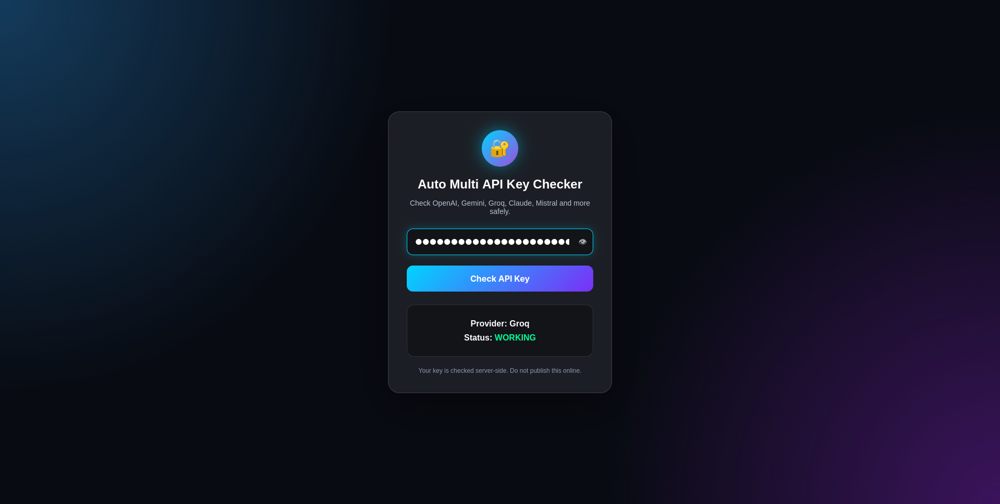

# 🔑 Multi API Key Checker

A simple Flask-based web application that verifies whether an API key is valid by testing it against multiple AI providers.

The application automatically checks supported providers and reports whether the supplied key is working, invalid, rate-limited, or access restricted.

---

## ✨ Features

* 🔐 Secure password input field
* 🌐 Web-based interface using Flask
* ⚡ Fast API validation
* 🎯 Automatic provider detection
* 📊 Clear status results
* 🖥️ Runs locally on any operating system
* 🧩 Easy to extend with additional AI providers

---

## Currently Supported Providers

* OpenAI
* Google Gemini
* Groq

More providers can be added easily.

---

## Project Structure

```
Multi-API-Key-Checker/
│
├── app.py
├── requirements.txt
├── templates/
│   └── index.html
│
├── static/
│
├── README.md
└── .gitignore
```

---

## Installation

Clone the repository:

```bash
git clone https://github.com/YOUR_USERNAME/Multi-API-Key-Checker.git

cd Multi-API-Key-Checker
```

Create a virtual environment:

### Linux / macOS

```bash
python3 -m venv venv

source venv/bin/activate
```

### Windows

```powershell
python -m venv venv

venv\Scripts\activate
```

Install dependencies:

```bash
pip install -r requirements.txt
```

---

## Run the Application

```bash
python app.py
```

Open your browser:

```
http://127.0.0.1:5000
```

---

## Requirements

* Python 3.10+
* Flask
* Requests

Install:

```bash
pip install flask requests
```

---

## How It Works

1. Enter an API key.
2. The application sends a small test request.
3. Supported providers are checked one by one.
4. The first successful response determines the provider.
5. The result is displayed on the webpage.

Possible results include:

* ✅ Working
* ⚠️ Valid but Rate Limited
* ⚠️ Access Forbidden
* ❌ Invalid API Key

---

## Technologies Used

* Python
* Flask
* Requests
* HTML5
* CSS3

---

## Example

```
Provider:
OpenAI

Status:
WORKING
```

---

## Security Notice

This application is intended for local development and testing.

* API keys are **not stored**.
* API keys are only used to make a single verification request.
* Avoid deploying this application publicly without implementing proper authentication, HTTPS, and server-side security measures.

---

## Future Improvements

* Support more AI providers
* Responsive dashboard
* AJAX (no page refresh)
* Dark / Light mode
* API request history
* Docker support
* One-click deployment
* Better error reporting
* Provider logos

---

## License

This project is released under the MIT License.

---

## Author

**Sayan Mahalanabish**

GitHub:
https://github.com/sayan08880

Portfolio:
https://sayan08880.github.io/PORTFOLIO/

LinkedIn:
https://linkedin.com/in/sayan-mahalanabish-4278571b6

---
## Image 
## 🖼️ Web Page


